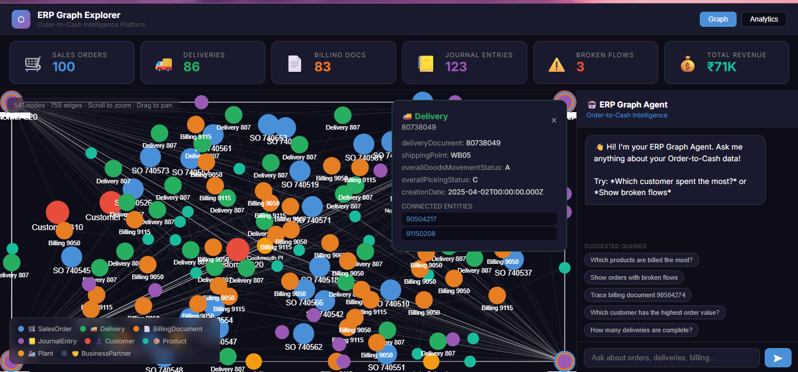
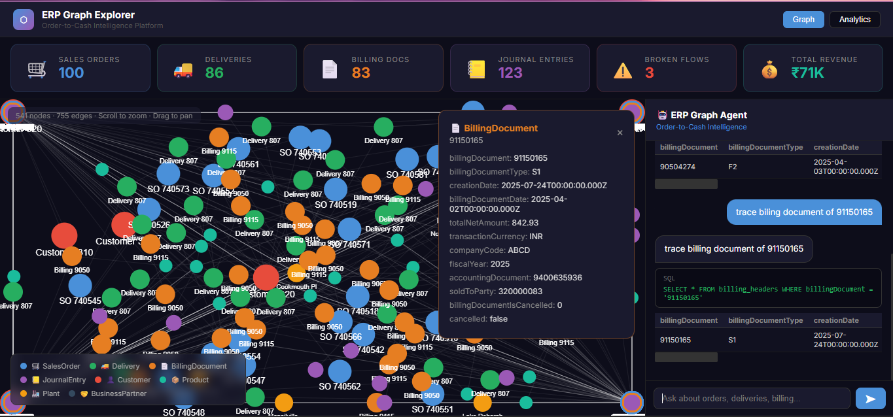
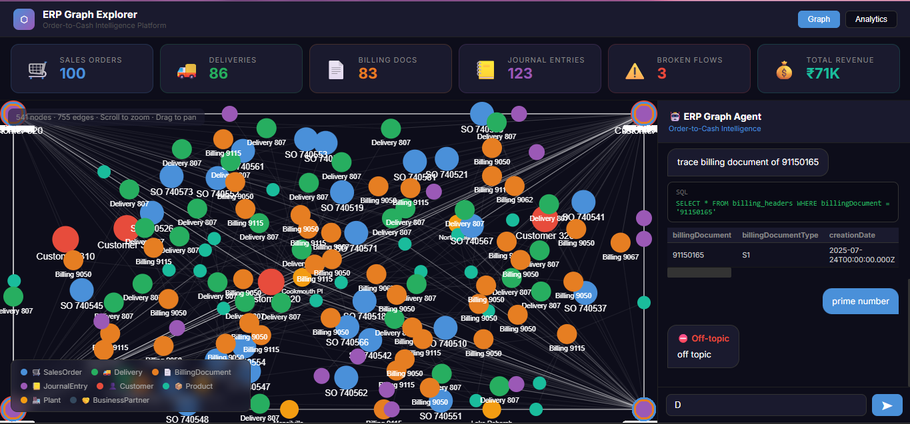
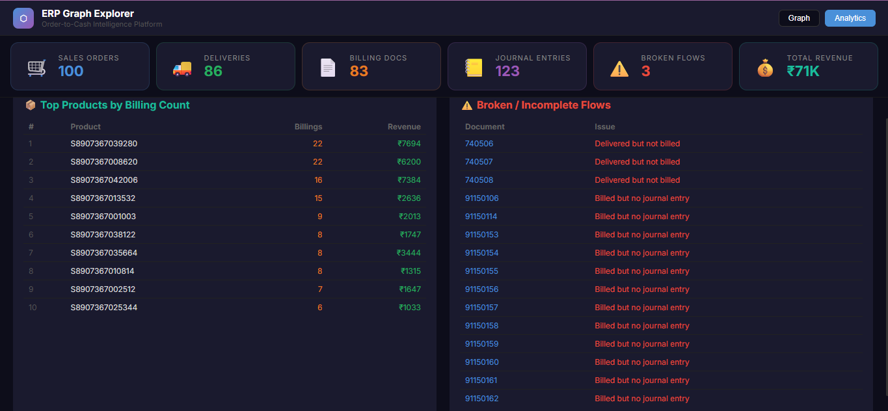
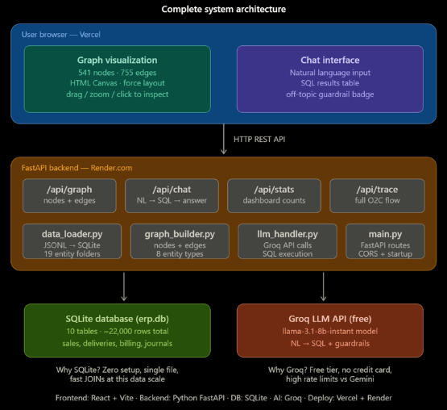
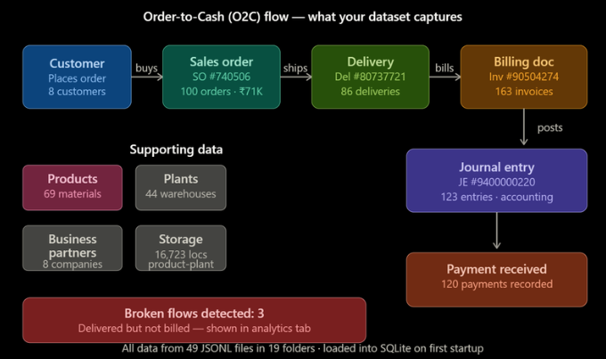

# ERP Graph Explorer — Order to Cash Intelligence Platform

> Full-stack AI system for exploring SAP Order-to-Cash data using graph visualization and natural language queries.

## 🚀 Features

- Interactive graph visualization (541 nodes, 755 edges)
- Natural language → SQL query system (LLM-powered)
- Guardrails for off-topic query rejection
- Real-time analytics dashboard
- End-to-end Order-to-Cash traceability
- Fast API backend with SQLite

## 🔗 Live Demo
**Frontend:** https://erp-graph-explorer.vercel.app  
**Backend API:** https://erp-graph-explorer.onrender.com/api/health

## 📸 Screenshots

### Graph Visualization


### AI Chat Answering Questions  


### Guardrails Rejecting Off-topic Query


### Analytics Dashboard


---
## 🛠️ Tech Stack

- **Frontend:** React, HTML Canvas, Vite  
- **Backend:** FastAPI (Python)  
- **Database:** SQLite  
- **AI/LLM:** Groq (LLaMA 3.1)  
- **Deployment:** Vercel (frontend), Render (backend)
  
---
## 🏗️ Architecture


This system connects a React frontend with a FastAPI backend, SQLite database,
and Groq LLM to enable graph-based analytics and natural language querying.

```
User Browser
├── Graph Canvas (541 nodes, 755 edges)
│   Force-directed layout, drag/zoom, click to inspect
└── Chat Interface (Natural Language → SQL → Answer)
        │
        ▼
FastAPI Backend (Python)
├── /api/graph     → nodes + edges
├── /api/chat      → NL query → LLM → SQL → answer  
├── /api/stats     → dashboard metrics
├── /api/trace     → full O2C flow trace
└── /api/broken-flows → incomplete flows
        │
   ┌────┴────┐
SQLite DB   Groq LLM API
(erp.db)   (llama-3.1-8b)
```

---

## 📊 Dataset — SAP Order-to-Cash

| Entity | Records |
|---|---|
| Sales Orders | 100 |
| Deliveries | 86 |
| Billing Documents | 163 |
| Journal Entries | 123 |
| Products | 69 |
| Plants | 44 |
| Customers | 8 |
| Payments | 120 |

### 🔄 Order-to-Cash Flow



## 💡 Why this project?

ERP systems are complex and hard to explore using traditional dashboards.
This project simplifies analysis by combining graph visualization with AI-powered querying,
making business insights accessible in natural language.

---

## 🗂️ Project Structure
```
erp-graph-explorer/
│
├── backend/                    # FastAPI backend services
│   ├── main.py                 # API routes (graph, chat, stats, trace)
│   ├── data_loader.py          # Load JSONL data → SQLite DB
│   ├── graph_builder.py        # Build nodes & edges for graph
│   ├── llm_handler.py          # LLM (Groq) + Text-to-SQL logic
│   └── requirements.txt        # Python dependencies
│
├── frontend/                   # React frontend application
│   ├── src/
│   │   └── App.jsx             # Main UI (graph + chat + dashboard)
│   └── index.html              # Entry HTML file
│
├── sap-o2c-data/               # SAP Order-to-Cash dataset (JSONL)
│   ├── sales_order_headers/
│   ├── outbound_delivery_headers/
│   ├── billing_document_headers/
│   └── ... (19 entity folders)
│
├── sessions/                   # AI coding session logs + screenshots
│   ├── graph.png
│   ├── chat.png
│   ├── guardrails.png
│   ├── dashboard.png
│   ├── o2c-flow.png
│   ├── architecture.png
│   └── claude-session.md
│
└── README.md                   # Project documentation

```

---

## 🧠 Database Choice — Why SQLite?

SQLite was chosen over Neo4j or PostgreSQL because:
- Zero setup — single file, ships with the app
- Dataset size (~5K records) is well within SQLite's sweet spot
- JOIN queries across 10 tables are fast at this scale
- Graph relationships are modelled in `graph_builder.py` at the application layer
- Easier to deploy on free tiers — no separate database server needed

At 100K+ records, a graph database like Neo4j would win on traversal speed. For this dataset, SQLite is the right tradeoff.

---

## 🤖 LLM Prompting Strategy

The system uses **Schema-Aware Text-to-SQL**:

1. **System prompt** contains the full database schema with table names, column descriptions, and foreign key relationships
2. **User question** is sent to Groq (llama-3.1-8b-instant)
3. LLM returns structured JSON: `{answer, sql, rows, referenced_ids, is_off_topic}`
4. SQL is executed against SQLite — answers are always data-backed
5. If SQL fails, error is fed back to LLM for self-healing retry
6. `referenced_ids` are used to highlight nodes in the graph

---

## 🛡️ Guardrails

Off-topic queries are rejected at the LLM level via system prompt instructions. Tested examples:
- ❌ "Who is Elon Musk?" → Rejected
- ❌ "Write me a poem" → Rejected  
- ❌ "What is the capital of France?" → Rejected
- ✅ "Which customer spent the most?" → Answered with data

---

## 💬 Example Queries

| Query | What happens |
|---|---|
| Which products are billed the most? | SQL on billing_items + products |
| Trace billing document 90504274 | JOIN across billing → delivery → sales order → journal |
| Show broken flows | LEFT JOIN to find deliveries without billing |
| Which customer spent the most? | SUM on sales_orders grouped by soldToParty |
| How many deliveries are complete? | COUNT with status filter = 'C' |

---

## 🚀 Run Locally
```bash
# Backend
cd backend
pip install -r requirements.txt
set GROQ_API_KEY=your_key_here
set DATA_DIR=../sap-o2c-data
uvicorn main:app --port 8000

# Frontend (new terminal)
cd frontend
npm install
npm run dev
# Open http://localhost:5173
```

---

## 🤖 AI Tools Used

Built using **Claude (claude.ai)** as the primary AI coding partner.
Session logs included in `/sessions/` folder.

Claude was used for:
- Architecture design (SQLite vs Neo4j decision)
- All backend code generation
- React frontend + force-directed graph canvas
- Debugging SQL and API issues
- LLM prompt engineering for guardrails

## 👩‍💻 Author

**Sunidhi Choudhary**  
